# dm-control

## 介绍
这是基于[ros-control](http://wiki.ros.org/ros_control)控制达妙电机的例程。

程序测试环境是ubuntu20.04  ROS1-Noetic。

硬件设备需要达妙的**USB转CANFD设备**或者达妙的**USB转CAN设备**，分别对应**u2canfd**文件夹和**u2can**文件夹。

最低支持的C++版本为C++11。

## 软件架构
main函数在dm_examples文件夹里。

## 安装教程
***安装需要ros基础，这里使用catkin build编译，而不是catkin_make***

首先打开终端，输入：
```shell
mkdir -p ~/catkin_ws
cd ~/catkin_ws
```
#### 1.使用USB转CANFD设备
如果你使用**USB转CANFD设备**，则把gitee上的**u2canfd**文件夹里的src文件夹放到catkin_ws目录下。

如下所示：

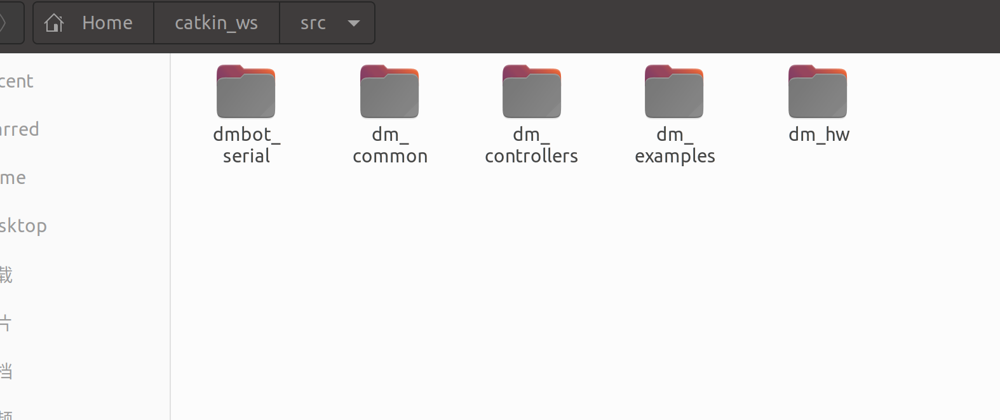

打开终端，先安装libusb库，输入：
```shell
sudo apt update
sudo apt install libusb-1.0-0-dev
```

然后检查**USB转CANFD设备**的连接，设备PID是0x6877，VID是0x34B7，在终端输入：
```shell
lsusb
```


然后给**USB转CANFD设备**设置权限，在终端输入：
```shell
sudo nano /etc/udev/rules.d/99-usb.rules
```
然后写入内容：
```shell
SUBSYSTEM=="usb", ATTR{idVendor}=="34b7", ATTR{idProduct}=="6877", MODE="0666"
```
然后重新加载并触发：
```shell
sudo udevadm control --reload-rules
sudo udevadm trigger
```
***注意：这个设置权限只需要设置1次就行，重新打开电脑、插拔设备都不需要重新设置**

然后需要通过程序找到**USB转CANFD设备**的Serial_Number，电脑插入**USB转CANFD设备**，然后编译并且运行对应的功能包:
```shell
cd ~/catkin_ws
catkin build dmbot_serial
source devel/setup.bash
roslaunch dmbot_serial dev_sn.launch
```
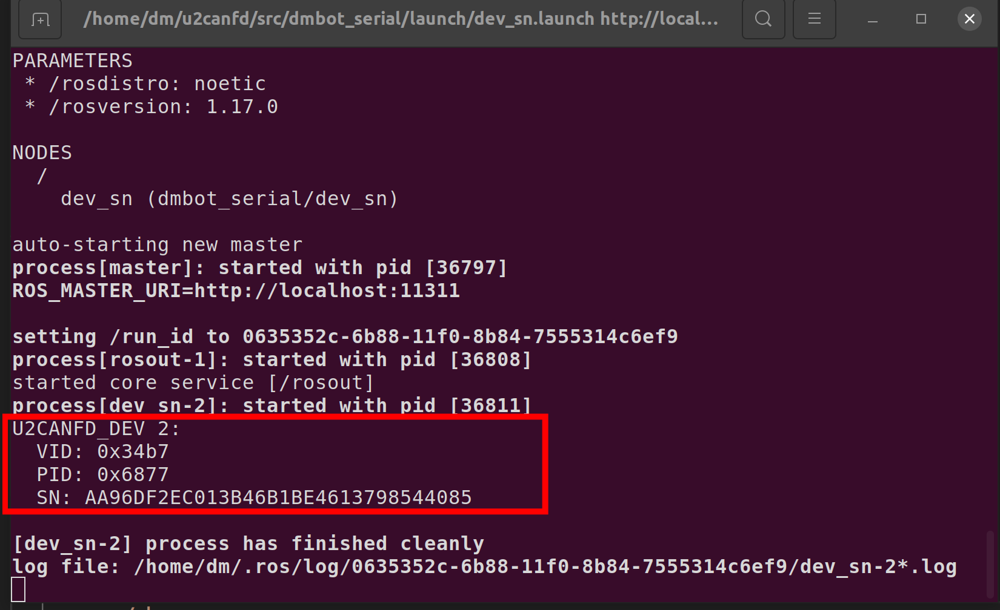

上面图片里的SN后面的一串数字就是该设备的的Serial_Number，

接着复制该Serial\_Number，打开dm_hw功能包里的DmHW.cpp，替换程序里的Serial\_Number,如下图所示：

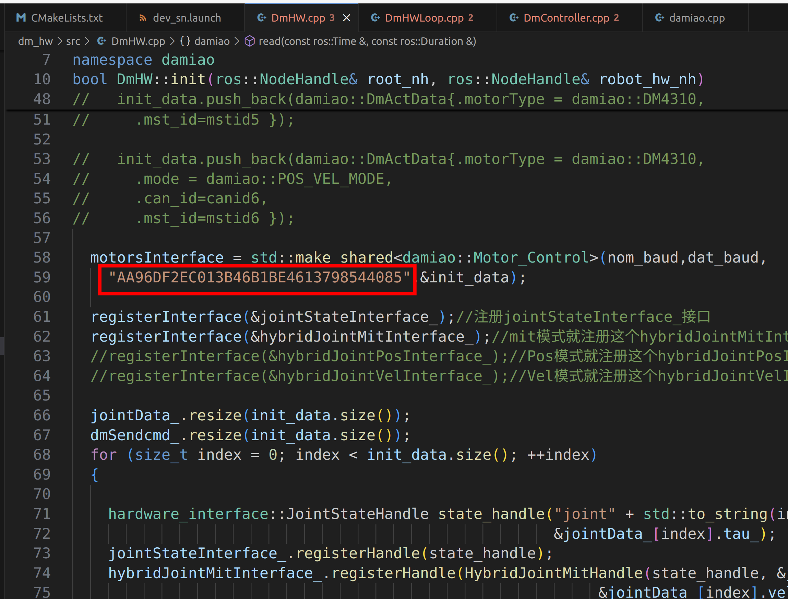

接着打开终端，编译所有功能包输入：
```shell
cd ~/catkin_ws
catkin build
```
然后打开.bashrc文件，在.bashrc文件里最后一行输入：
```
source ~/catkin_ws/devel/setup.bash
```
然后在终端输入：
```
cd
source .bashrc
```
#### 2.使用USB转CAN设备
如果你使用**USB转CAN设备**，则把gitee上的**u2can**文件夹里的src文件夹放到catkin_ws目录下。

如下所示：

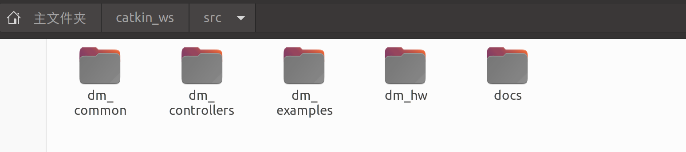

打开终端，输入：
```shell
cd ~/catkin_ws
catkin init
catkin build
```
然后在.bashrc文件里最后一行输入：
```
source ~/catkin_ws/devel/setup.bash
```
然后在终端输入：
```
cd
source .bashrc
```

## 使用说明
### 使用USB转CANFD设备
#### 1.硬件连接
需要用到达妙**USB转CANFD设备**（其他的usb转canfd模块不支持）一端接电脑，一端接电机。

默认程序运行的效果是通过mit模式让can_id为0x01，mst\_id为0x11的一个DM4310电机旋转，**电机波特率为5M**。

#### 2.运行
首先用最新上位机给电机设置5M波特率。

接着运行程序，在终端输入：
```shell
roslaunch dm_controllers load_dm_hw.launch
```
#### 3.添加电机
下面给出一个在默认程序基础上，添加一个can_id为0x02，mst\_id为0x12的DM4340电机和一个can\_id为0x03，mst\_id为0x13的DM8006电机，**电机波特率都为5M**。

***注意：5M波特率下，电机有多个时，需要在末端电机接一个120欧的电阻***

首先在~/catkin_ws/src/dm\_hw/src/DmHW.cpp里添加如下几段：

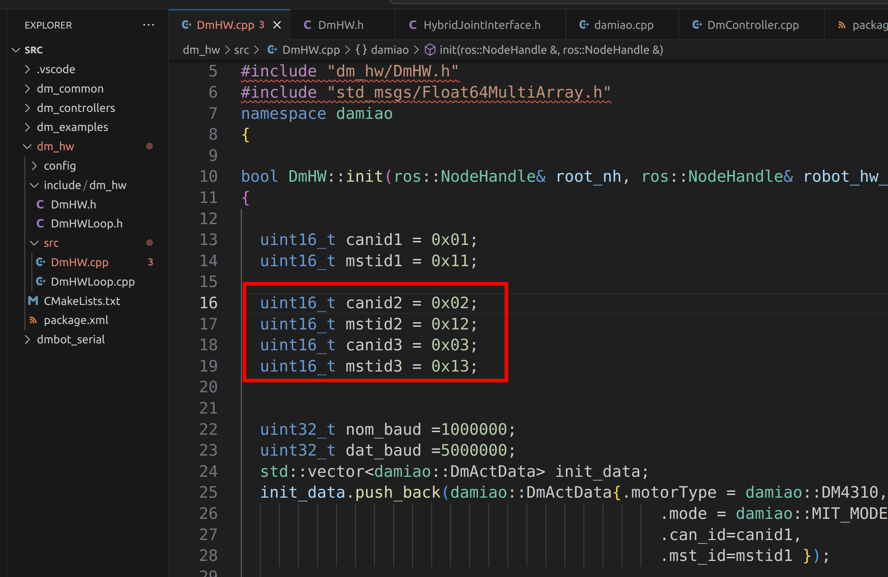


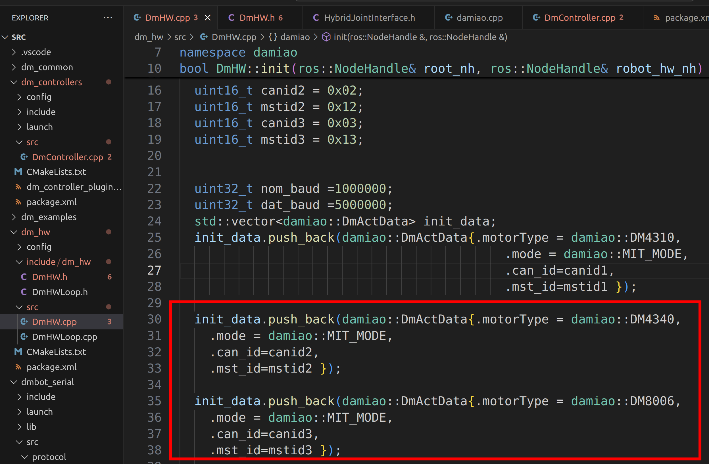

然后在~/catkin_ws/src/dm\_controllers/src/DmController.cpp修改如下地方：

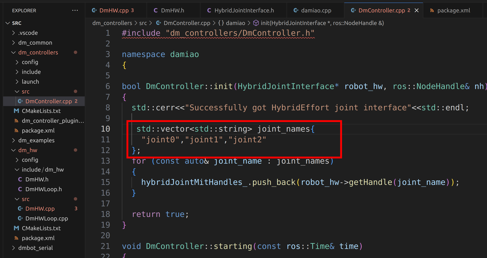


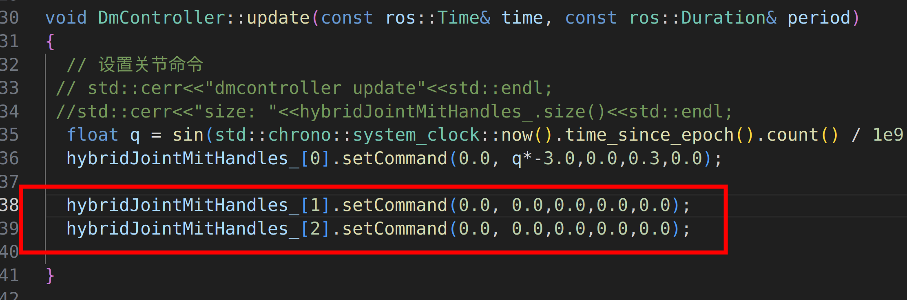

然后编译，打开终端，输入：
```shell
cd ~/catkin_ws
catkin build
```
然后在终端输入：
```
cd
source .bashrc
```

接着运行程序，在终端输入：
```shell
roslaunch dm_controllers load_dm_hw.launch
```


### 使用USB转CAN设备
#### 1.硬件连接
需要用到达妙**USB转CAN设备**（其他的usb转can模块不支持）一端接电脑，一端接电机。

默认程序运行的效果是通过mit模式让can_id为0x01，mst\_id为0x11的一个DM4310电机按sin速度旋转。

#### 2.运行
首先检查**USB转CAN设备**的连接，在终端输入：
```shell
cd
ls /dev/ttyACM*
```
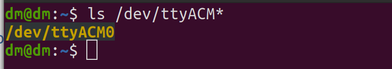

然后给**USB转CAN设备**设置权限，在终端输入：
```shell
sudo chmod -R 777 /dev/ttyACM*
```
接着运行程序，在终端输入：
```shell
roslaunch dm_controllers load_dm_hw.launch
```

#### 3.添加电机

下面给出一个在默认程序基础上，添加一个属于 **/dev/ttyACM0接口** 的can_id为0x04，mst\_id为0x14的DM8006电机和一个属于 **/dev/ttyACM1接口** 的can\_id为0x03，mst\_id为0x13的DM8006电机。

首先在~/catkin_ws/src/dm\_controllers/config/dm\_motor.yaml里添加如下几段：

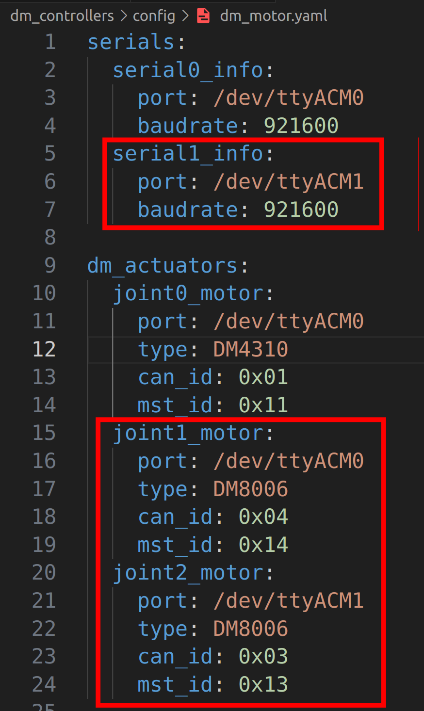

然后在~/catkin_ws/src/dm\_controllers/src/DmController.cpp修改如下地方：

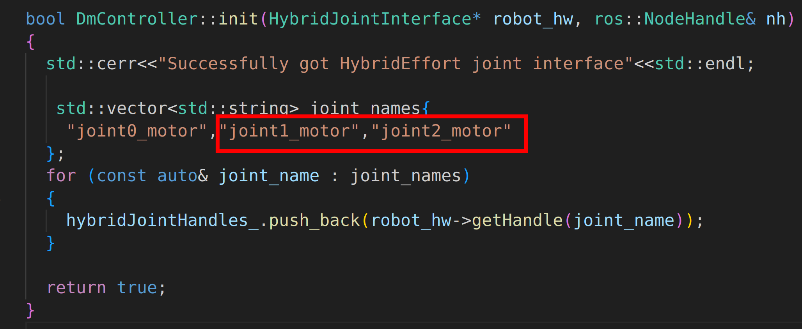


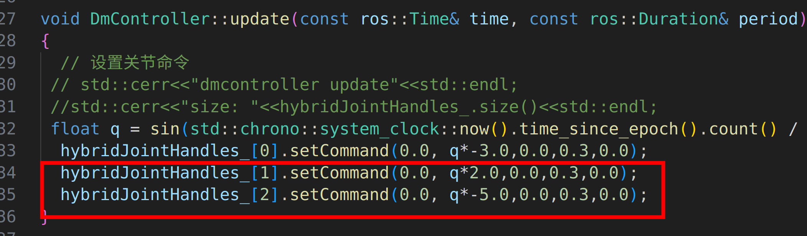

然后编译，打开终端，输入：
```shell
cd ~/catkin_ws
catkin build
```
然后在终端输入：
```
cd
source .bashrc
```

然后检查**USB转CAN设备**的连接，在终端输入：
```shell
cd
ls /dev/ttyACM*
```
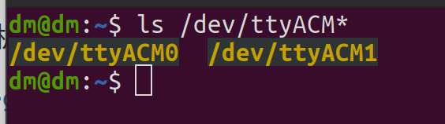

然后给**USB转CAN设备**设置权限，在终端输入：
```shell
sudo chmod -R 777 /dev/ttyACM*
```
接着运行程序，在终端输入：
```shell
roslaunch dm_controllers load_dm_hw.launch
```

## 参考
#### 代码参考

https://gitee.com/kit-miao/motor-control-routine/tree/6f2f966ab56404fc543438a7b50a021fbcdb91ec/C++%E4%BE%8B%E7%A8%8B

https://github.com/qiayuanl/legged_control


