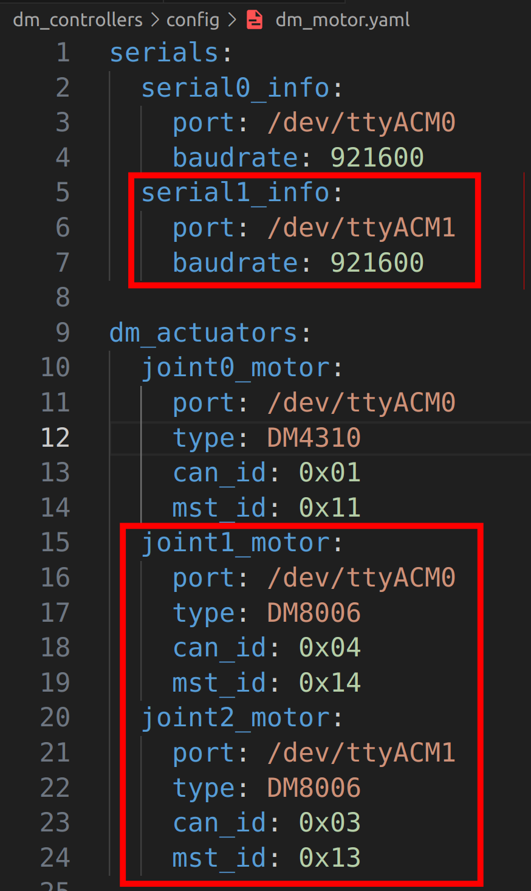
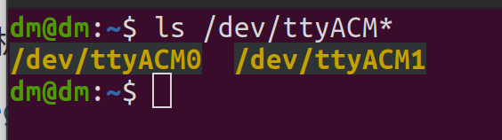

# dm-control

## 介绍
这是基于[ros-control](http://wiki.ros.org/ros_control)控制达妙电机的例程

程序测试环境是ubuntu20.04  ROS1-Noetic

硬件设备需要达妙的usb转can模块

最低支持的C++版本为C++11

## 软件架构
main函数在dm_examples文件夹里

## 安装教程
***安装需要ros基础，这里使用catkin build编译，而不是catkin_make***

首先打开终端，输入：
```shell
mkdir -p ~/catkin_ws
cd ~/catkin_ws
```
然后把gitee上的src文件夹放到catkin_ws目录下，如下所示：


打开终端，输入：
```shell
cd ~/catkin_ws
catkin init
catkin build
```
然后在.bashrc文件里最后一行输入：
```
source ~/catkin_ws/devel/setup.bash
```
然后在终端输入：
```
cd
source ~/catkin_ws/devel/setup.bash
```
## 使用说明
#### 硬件连接

需要用到达妙的usb转can模块（其他的usb转can模块不支持）一端接电脑，一端接电机。

默认程序运行的效果是通过mit模式让can_id为0x01，mst\_id为0x11的一个DM4310电机旋转。

#### 运行

首先检查usb转can模块的连接，在终端输入：
```shell
cd
ls /dev/ttyACM*
```


然后给usb转can设备设置权限，在终端输入：
```shell
sudo chmod -R 777 /dev/ttyACM*
```
接着运行程序，在终端输入：
```shell
roslaunch dm_controllers load_dm_hw.launch
```
#### 添加电机

下面给出一个在默认程序基础上，添加一个属于 **/dev/ttyACM0接口** 的can_id为0x04，mst\_id为0x14的DM8006电机和一个属于 **/dev/ttyACM1接口** 的can\_id为0x03，mst\_id为0x13的DM8006电机。

首先在~/catkin_ws/src/dm\_controllers/config/dm\_motor.yaml里添加如下几段：



然后在~/catkin_ws/src/dm\_controllers/src/DmController.cpp修改如下地方：


然后检查usb转can模块的连接，在终端输入：
```shell
cd
ls /dev/ttyACM*
```


然后给usb转can设备设置权限，在终端输入：
```shell
sudo chmod -R 777 /dev/ttyACM*
```
接着运行程序，在终端输入：
```shell
roslaunch dm_controllers load_dm_hw.launch
```

## 参考
#### 代码参考

https://gitee.com/kit-miao/motor-control-routine/tree/6f2f966ab56404fc543438a7b50a021fbcdb91ec/C++%E4%BE%8B%E7%A8%8B

https://github.com/qiayuanl/legged_control


