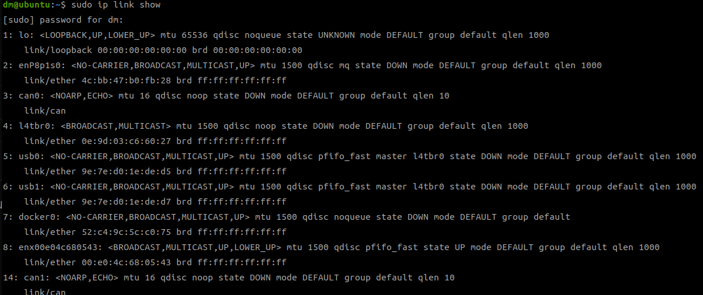
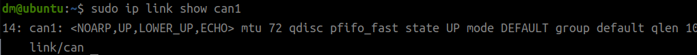

# SocketCAN Python例程

本目录提供基于 Linux SocketCAN 的 Python 电机控制示例，支持达妙单双路 USB2CANFD 模块。

USB2CANFD 模块需要烧录 SocketCAN 专用固件：[gs_usb固件安装](https://gitee.com/kit-miao/dm-tools/tree/master/USB2CANFD/%E5%9B%BA%E4%BB%B6/socketcan/gsusb%E5%85%8D%E9%A9%B1%E5%9B%BA%E4%BB%B6)，烧录方式与普通固件一致。

***注意：模块安装 SocketCAN 专用固件后，将无法连接使用上位机！若要使用上位机，请先刷回普通固件。***

如需刷回普通固件或升级 SocketCAN 固件，请下载 [USB2CANFD通用升级工具](https://gitee.com/kit-miao/dm-tools/tree/master/USB2CANFD%E9%80%9A%E7%94%A8%E5%8D%87%E7%BA%A7%E5%B7%A5%E5%85%B7)。


## 环境要求

Linux系统，若主控为 arm 架构，可能需安装的驱动：[gs_usb_drives](https://gitee.com/kit-miao/dm-tools/tree/master/gs_usb_drives)

## 1. 激活 USB2CANFD

插入 USB2CANFD 后，先确认系统识别到 CAN ：

```bash
sudo ip link show
```

***注意：arm 架构下，can0 可能是本机的 CAN 接口。***
***若确认 USB2CANFD 设备可以被系统发现，但仍没有发现模块的can口，则需要安装驱动 [gs_usb_drives](https://gitee.com/kit-miao/dm-tools/tree/master/gs_usb_drives)***
如果不确定哪个接口是 USB2CANFD，可以先拔出 USB2CANFD 模块，再执行 `sudo ip link show` 对比接口变化。

如果设备名是 `can1`，使用以下命令以 CAN FD 模式启动：

```bash
sudo ip link set can1 up type can bitrate 1000000 dbitrate 5000000 fd on
```

如果 `can1` 已经处于 up 状态，建议先关闭后重新配置：

```bash
sudo ip link set can1 down
sudo ip link set can1 type can bitrate 1000000 dbitrate 5000000 fd on
sudo ip link set can1 up
```

查看接口状态：

```bash
ip link show can1
```



## 2. 运行 test.py

进入仓库根目录：

```bash
cd /home/linrunxi/test/SocketCan控制
```

运行 Python 示例：

```bash
python3 Python例程/test.py
```
发现电机开始按一定速度转动，按 `Ctrl+C` 可以退出程序。

`test.py` 中默认使用 `can0`：

```python
robot_ptr1_ = Motor_Control("can0", init_data, Can_control_Mode.canfd)
```

如果 USB2CANFD 识别为 `can1`，请修改为：

```python
robot_ptr1_ = Motor_Control("can1", init_data, Can_control_Mode.canfd)
```

程序运行后会循环发送速度控制指令，并打印电机位置、速度、力矩和通信时间间隔。


## 默认电机配置

当前 `test.py` 默认配置 2 个电机：

- 电机 1：`can_id = 0x01`，`mst_id = 0x11`
- 电机 2：`can_id = 0x02`，`mst_id = 0x12`

默认电机型号为 `DM4310`，默认控制模式为 `VEL_MODE`。
